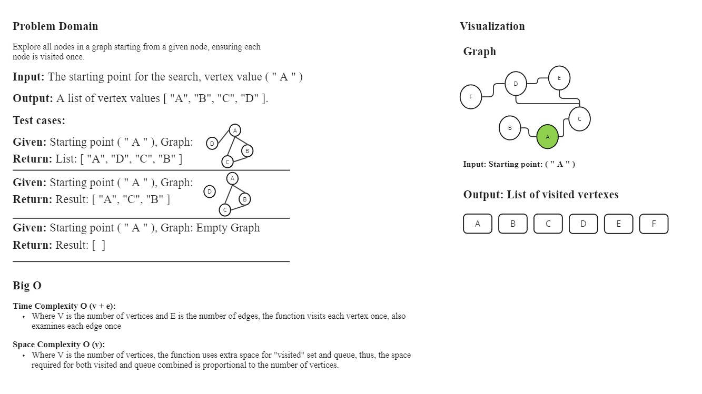
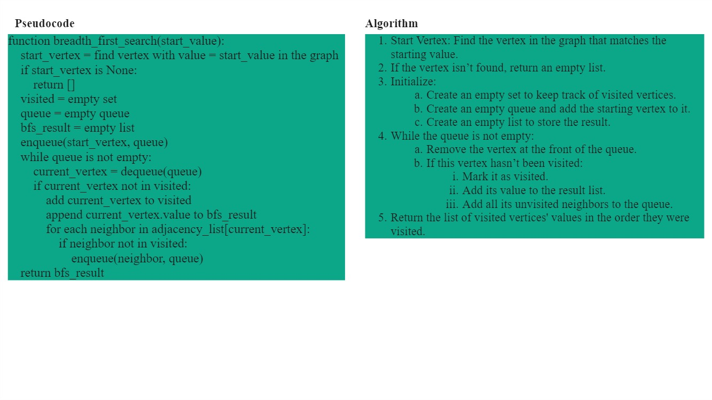
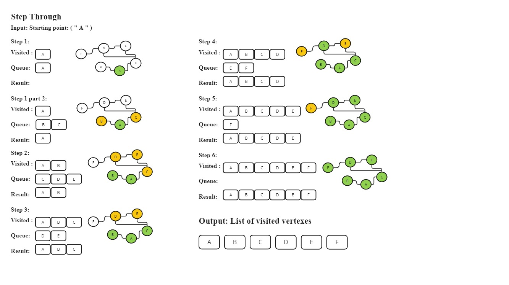

# `breadth_first_search(self, start_value)`

Performs a breadth-first search (BFS) traversal starting from the vertex with the specified value.

## Arguments

- **`start_value`** (`str`): The value of the starting vertex from which the BFS traversal begins.

## Returns

- **`list`**: A list containing the values of the vertices visited during the BFS traversal, in the order they were visited.

## Description

1. **Locate Start Vertex**:
   - Iterates through the vertices in the graph to find the vertex with the value matching `start_value`.
   - If no such vertex is found, an empty list is returned.

2. **Initialize BFS**:
   - Uses a queue to manage the order of vertex visits and a set to keep track of visited vertices.
   - Starts BFS traversal from the `start_vertex`.

3. **Traversal**:
   - Continues processing vertices from the queue:
     - Dequeues the current vertex.
     - Marks it as visited and appends its value to the result list.
     - Enqueues all unvisited neighboring vertices.

4. **Return**:
   - Returns a list of values representing the order of vertices visited during the traversal.

## White-Board

