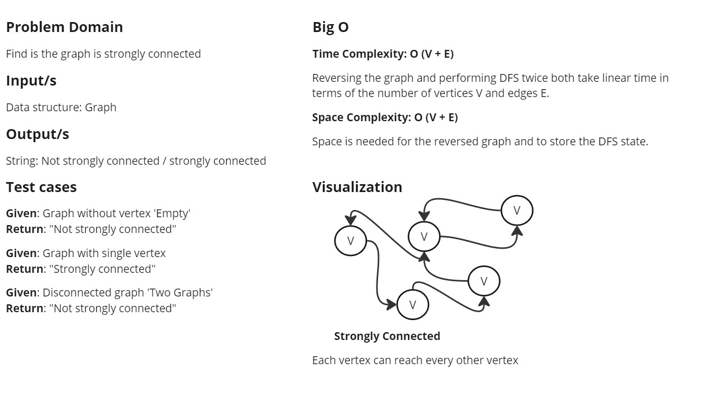
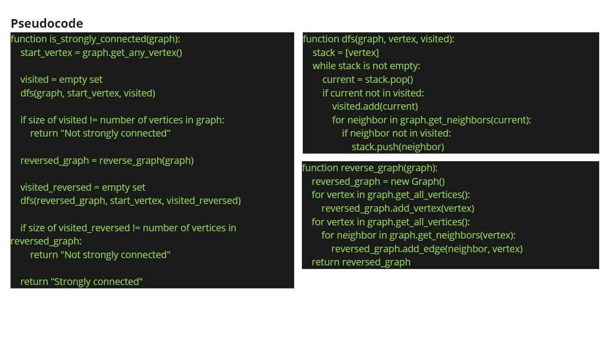
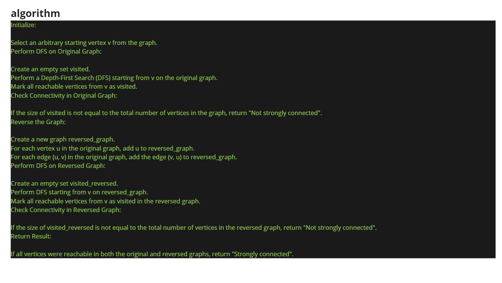
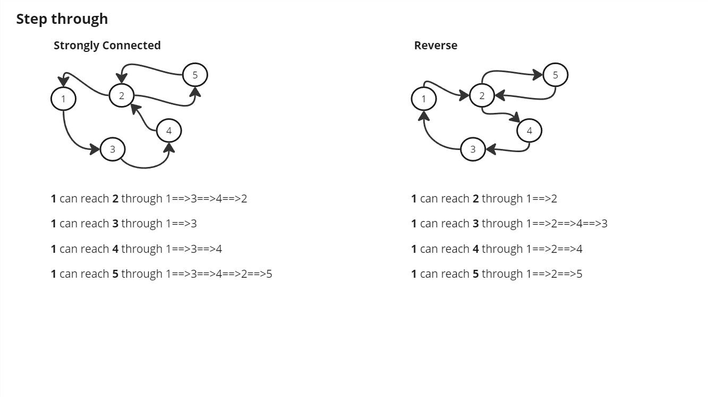

# `is_strongly_connected` Method

## Description

Determines whether a directed graph is strongly connected.

A directed graph is considered strongly connected if there is a path from any vertex to every other vertex in the graph.

## Algorithm

1. **Select a Starting Vertex**:
   - Choose an arbitrary vertex `v` from the graph.

2. **Perform DFS on Original Graph**:
   - Initialize an empty set `visited`.
   - Perform Depth-First Search (DFS) starting from `v`.
   - Add all reachable vertices from `v` to the `visited` set.

3. **Check Connectivity in Original Graph**:
   - If the size of `visited` is not equal to the total number of vertices in the graph, return `"Not strongly connected"`.

4. **Reverse the Graph**:
   - Create a new graph `reversed_graph`.
   - For each vertex `u` in the original graph, add `u` to `reversed_graph`.
   - For each edge `(u, v)` in the original graph, add the edge `(v, u)` to `reversed_graph`.

5. **Perform DFS on Reversed Graph**:
   - Initialize an empty set `visited_reversed`.
   - Perform DFS starting from `v` on `reversed_graph`.
   - Add all reachable vertices from `v` in the reversed graph to the `visited_reversed` set.

6. **Check Connectivity in Reversed Graph**:
   - If the size of `visited_reversed` is not equal to the total number of vertices in the reversed graph, return `"Not strongly connected"`.

7. **Return Result**:
   - If all vertices are reachable in both the original and reversed graphs, return `"Strongly connected"`.

### Parameters

- **graph**: A directed graph represented by an adjacency list or adjacency matrix.

### Returns

- **String**: `"Strongly connected"` if the graph is strongly connected, otherwise `"Not strongly connected"`.

## White-Board

