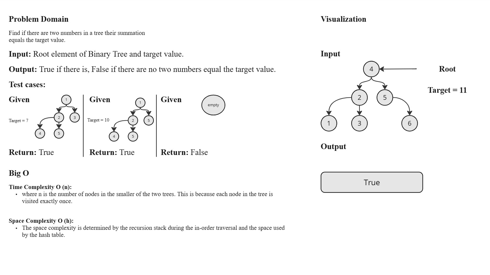
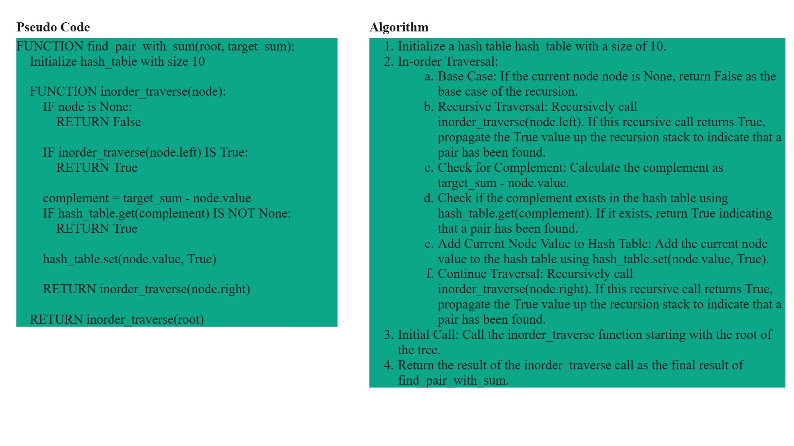
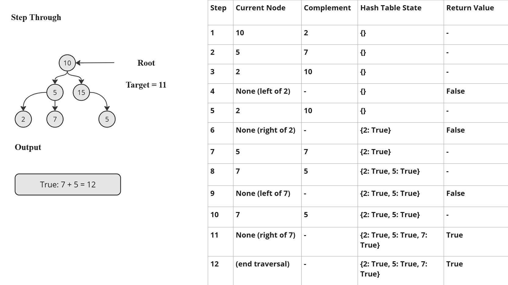

# Data Structures and Algorithms

## Node Class

The `Node` class represents a single node in a linked list.

### Node Methods

- `__init__(data)`
  - Initializes a Node with the given `data` and sets the `next` node to `None`.

## LinkedList Class

The `LinkedList` class represents a linked list data structure.

### LinkedList Methods

- `__init__()`
  - Initializes an empty `LinkedList` with the head set to `None`.

- `add(data)`
  - Adds a node with the given `data` to the end of the `LinkedList`.

- `__iter__()`
  - Allows iteration over the `LinkedList`, yielding the data of each node.

- `__str__()`
  - Returns a string representation of the `LinkedList`.

## HashTable Class

The `HashTable` class represents a hash table data structure.

### HashTable Methods

- `__init__(size=10)`
  - Initializes a `HashTable` with the given `size`. Default size is 10.

- `hash_key(key)`
  - Generates a hash for the given `key` using Python's standard hash function.

- `set(key, value)`
  - Sets the key-value pair in the `HashTable`. Handles collisions using chaining.

- `get(key)`
  - Retrieves the value for the given `key` from the `HashTable`.

## TreeNode Class

The `TreeNode` class represents a node in a binary search tree.

### TreeNode Methods

- `__init__(value=0, left=None, right=None)`
  - Initializes a `TreeNode` with the given `value` and optional left and right children.

## Algorithm: Find Pair with Sum

The `find_pair_with_sum` function finds if there exists a pair of nodes in the binary search tree that sum to the `target_sum`.

### Parameters

- `root`
  - The root node of the binary search tree.
- `target_sum`
  - The target sum to find in the tree.

### Returns

- `True` if a pair with the given sum exists, otherwise `False`.

### Internal Process

- Uses an in-order traversal of the tree.
- Utilizes a `HashTable` to keep track of visited nodes and their complements.

## White-Board

