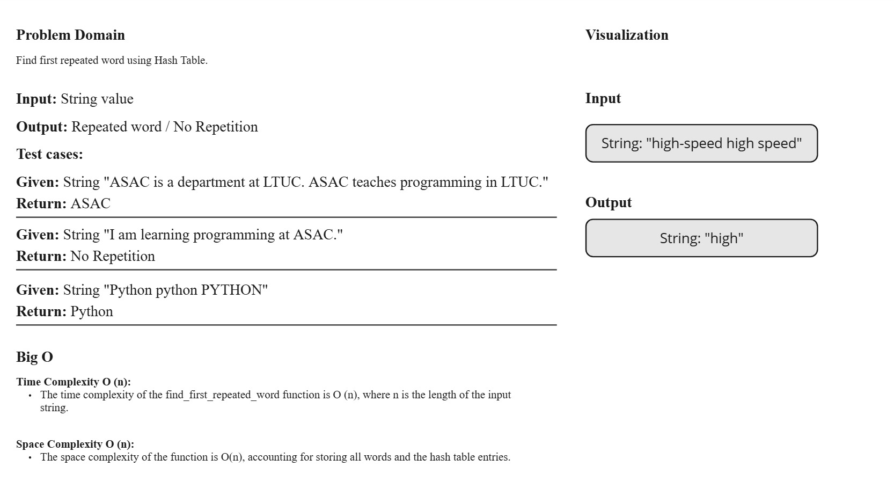
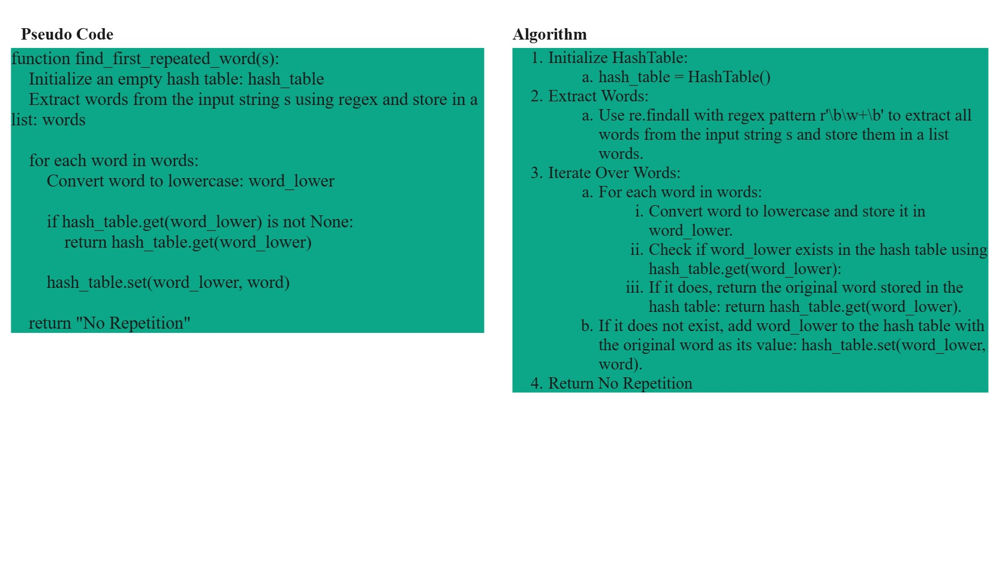
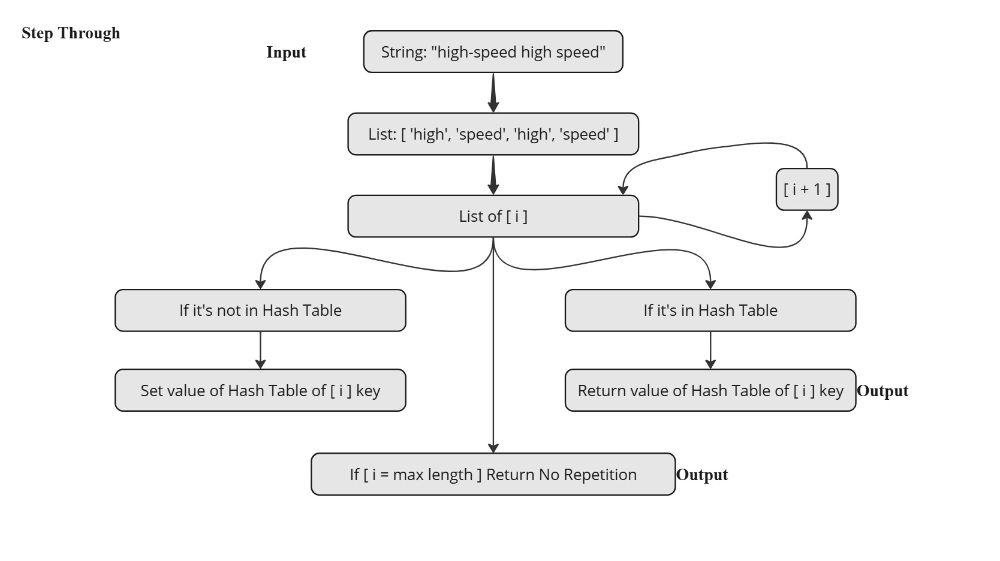

# First Repeated Word

## Overview

This implementation provides a simple hash table with separate chaining for collision resolution using a linked list. The `HashTable` class allows for storing and retrieving key-value pairs efficiently. Additionally, a function `find_first_repeated_word` is implemented to find the first repeated word in a given string.

## Classes and Methods

### HashTable Class

A simple HashTable implementation using separate chaining for collision resolution.

#### `__init__(self, size=10)`

Initializes a HashTable with the given size. Default size is 10.

#### `hash_key(self, key)`

Generates a hash for the given key using Python's standard hash function.

- **Args:**
  - `key (str)`: The key to hash.
- **Returns:**
  - `int`: The hashed value of the key.

#### `set(self, key, value)`

Sets the key-value pair in the HashTable. Handles collisions using chaining.

- **Args:**
  - `key (str)`: The key to set.
  - `value (any)`: The value to associate with the key.

#### `get(self, key)`

Retrieves the value for the given key from the HashTable.

- **Args:**
  - `key (str)`: The key to retrieve.
- **Returns:**
  - `any`: The value associated with the key, or `None` if the key is not found.

### Node Class

A Node in a LinkedList, used for chaining in the HashTable.

#### `__init__(self, key, value)`

Initializes a Node with a key-value pair.

- **Args:**
  - `key (str)`: The key of the node.
  - `value (any)`: The value of the node.

### LinkedList Class

A simple LinkedList implementation for chaining in the HashTable.

#### `__init__(self)`

Initializes an empty LinkedList.

#### `add(self, pair)`

Adds a new node with the given key-value pair to the end of the LinkedList.

- **Args:**
  - `pair (list)`: A list containing the key and value.

#### `find(self, key)`

Finds the value associated with the given key in the LinkedList.

- **Args:**
  - `key (str)`: The key to find.
- **Returns:**
  - `any`: The value associated with the key, or `None` if the key is not found.

## Function

### `find_first_repeated_word(s)`

Finds the first repeated word in a given string.

- **Args:**
  - `s (str)`: The input string.
- **Returns:**
  - `str`: The first repeated word, or "No Repetition" if no word is repeated.

## White-Board

