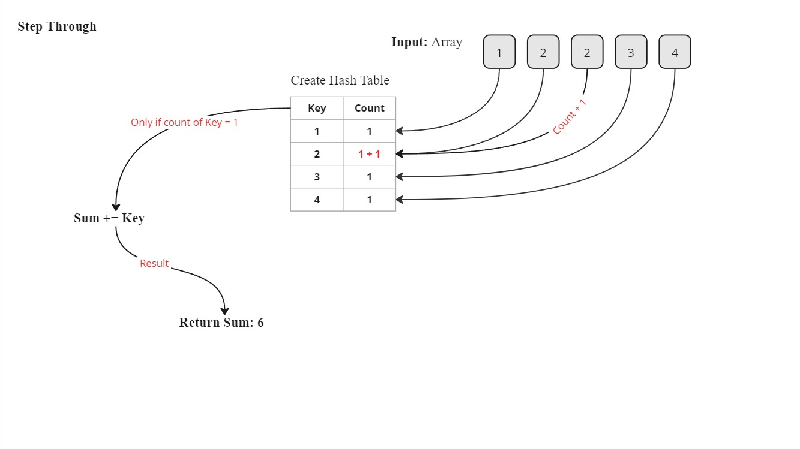

# Sum of unique elements

## Overview

This module contains implementations of a basic Hash Table with collision handling using a Linked List, and a function to compute the sum of unique elements from an array.

## Classes

### `Node`

Represents a node in the linked list.

#### Node Methods

- **`__init__(self, data)`**: Initializes a `Node` with the given data and sets the `next` node to `None`.

### `LinkedList`

Represents a linked list for handling collisions in the hash table.

#### LinkedList Methods

- **`__init__(self)`**: Initializes an empty `LinkedList` with the head set to `None`.

- **`add(self, data)`**: Adds a node with the given data to the end of the `LinkedList`.

- **`find(self, key)`**: Finds and returns the node with the given key in the `LinkedList`. Returns `None` if the key is not found.

- **`__iter__(self)`**: Allows iteration over the `LinkedList`, yielding the data of each node.

- **`__str__(self)`**: Returns a string representation of the `LinkedList`.

### `HashTable`

Represents a hash table with collision handling using chaining.

#### HashTable Methods

- **`__init__(self, size=10)`**: Initializes a `HashTable` with the given size. Default size is 10.

- **`hash_key(self, key)`**: Generates a hash for the given key using the Python standard hash function.

- **`set(self, key, value)`**: Sets the key-value pair in the `HashTable`. Handles collisions using chaining.

- **`get(self, key)`**: Retrieves the value for the given key from the `HashTable`.

## Functions

### `sum_of_unique_elements(nums)`

Finds the summation of unique elements in the array and returns the summation. Unique elements are those that appear exactly once in the array.

#### Arguments

- **`nums`**: A list of integers.

#### Returns

- **`int`**: The sum of unique elements.

## White-Board

