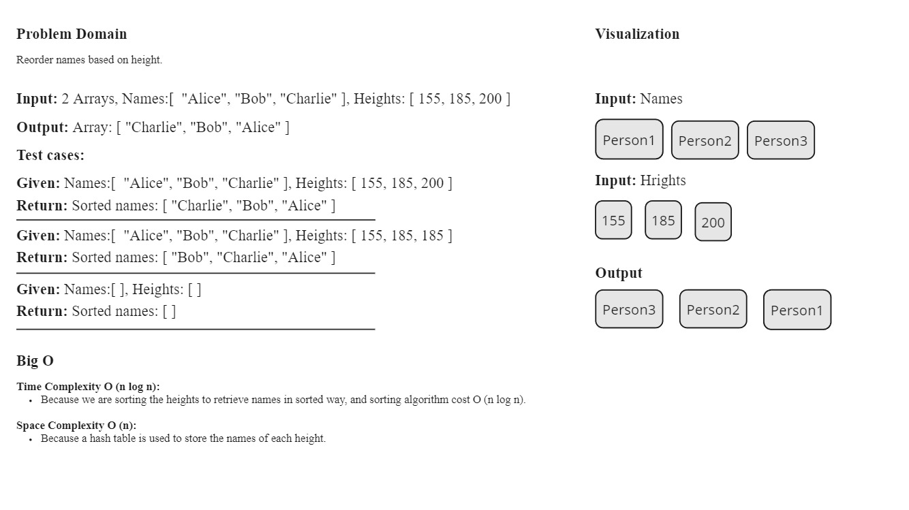
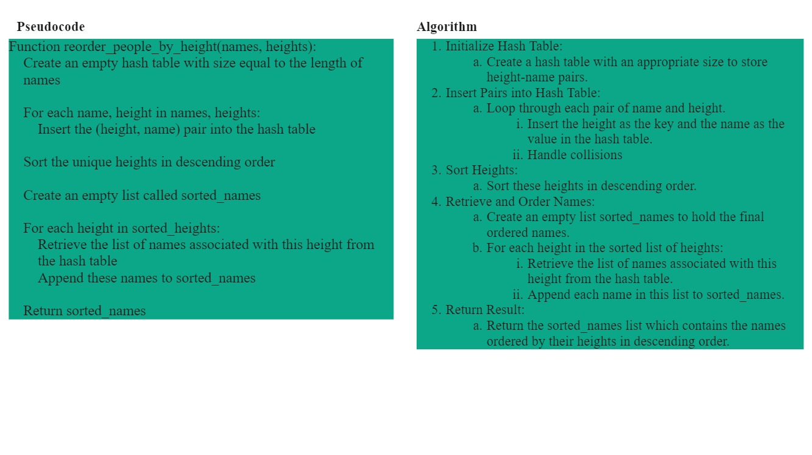
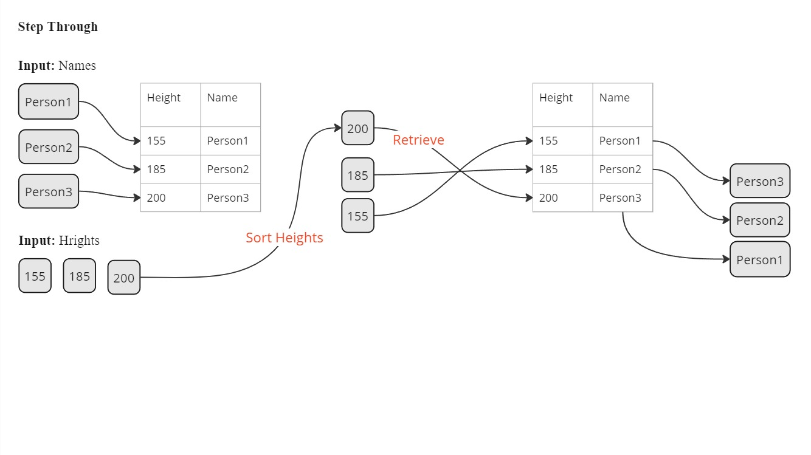

# `reorder_people_by_height` Function Documentation

## Overview

The `reorder_people_by_height` function reorders a list of names based on their corresponding heights in descending order. It uses a hash table to map heights to names and then retrieves the names in sorted order of heights.

## Arguments

- `names` (list): A list of names.
- `heights` (list): A list of heights corresponding to the names.

## Returns

- `list`: A list of names ordered by height in descending order.

## Methodology

1. **Hash Table Initialization**:
    - A hash table is created with a size equal to the number of names. This table will store heights as keys and lists of names as values.

2. **Populating the Hash Table**:
    - The function iterates over the `names` and `heights` lists simultaneously.
    - For each pair of name and height, the height is used as a key in the hash table, and the corresponding name is added to the list of names for that height.

3. **Sorting the Heights**:
    - Unique heights are extracted and sorted in descending order. This creates a list of heights from the tallest to the shortest.

4. **Retrieving Names in Sorted Order**:
    - An empty list `sorted_names` is initialized.
    - The function iterates over the sorted list of heights.
    - For each height, the names associated with that height are retrieved from the hash table and added to the `sorted_names` list.

5. **Returning the Result**:
    - The `sorted_names` list, which now contains names ordered by height in descending order, is returned as the result.

## White-Board

