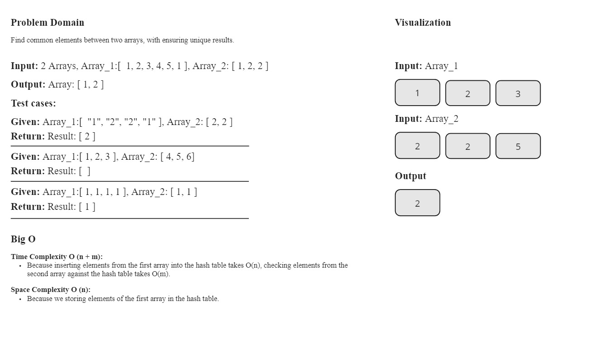
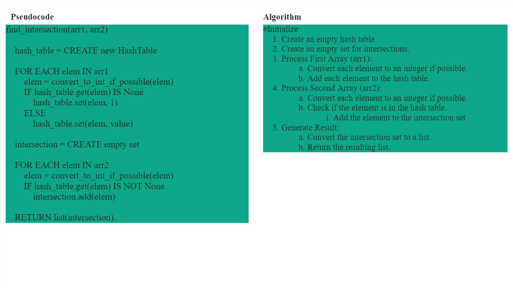
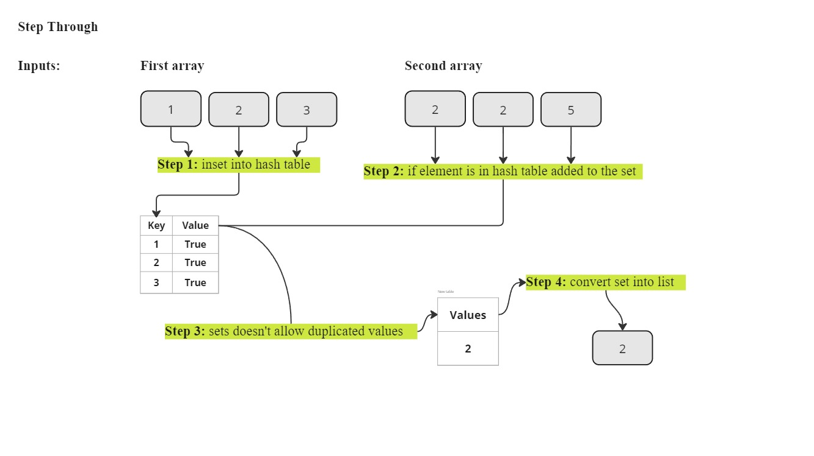

# `find_intersection` Function Documentation

## Description

The `find_intersection` function finds the intersection of two arrays, converting string elements to integers when possible. It returns a list of unique elements that are found in both arrays.

## Parameters

- `arr1` (list): The first array, containing strings or integers.
- `arr2` (list): The second array, containing strings or integers.

## Returns

- list: A list of unique elements found in both arrays.

## Variables

- `size` (int): The maximum size of the two arrays.

## White-Board

