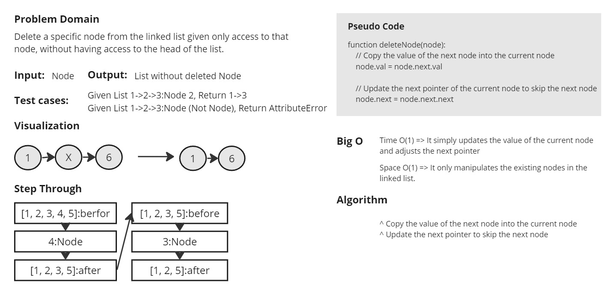

# White Board

A Python implementation of a singly linked list.

## Node Class

Represents a node in the linked list.

### Node Attributes

- `data`: The data stored in the node.
- `next`: Reference to the next node in the list.

## LinkedList Class

A class representing a singly linked list.

### LinkedList Attributes

- `head`: The head node of the linked list.

### Methods

#### `__init__()`

Initializes an empty linked list.

#### `append(data)`

Appends a new node with the given data to the end of the linked list.

- `data`: The data to be stored in the new node.

#### `__str__()`

Converts the linked list to a string representation.

Returns:

- A string representation of the linked list.

#### `delete_node(node)`

Deletes the given node from the linked list and returns it.

Args:

- `node`: The node to be deleted.

Returns:

- The deleted node.

Raises:

- ValueError: If the node is None.
