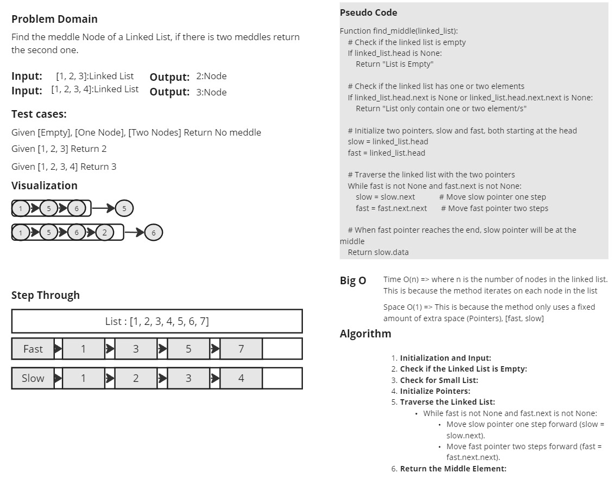

# LinkedList Implementation and Testing

This repository contains a Python implementation of a singly linked list, along with a method to find the middle element of the list. Additionally, it includes tests for the linked list using `pytest`.

## White Board

