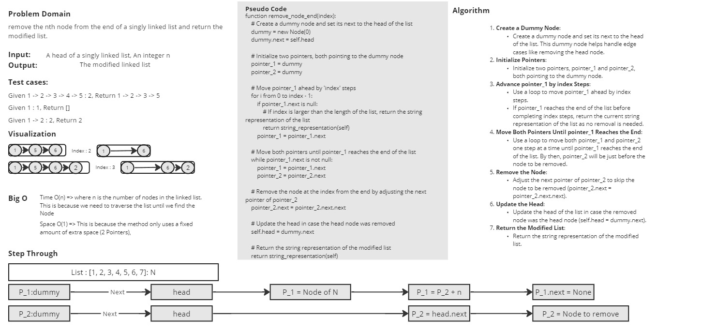

# Singly Linked List Remove_From_End Implementation in Python

This repository contains a Python implementation of a singly linked list data structure. It includes a `Node` class representing a node in the linked list and a `LinkedList` class representing the linked list itself.

## Node Class

The `Node` class represents a node in the singly linked list.

### Node Attributes

- `data`: The data stored in the node.
- `next` (Node): A reference to the next node in the linked list.

### Node Methods

- `__init__(self, data=None)`: Initializes a new node with the given data.
  
## LinkedList Class

The `LinkedList` class represents a singly linked list.

### LinkedList Attributes

- `head` (Node): The head node of the linked list.

### LinkedList Methods

- `__init__(self)`: Initializes an empty linked list.
- `append(self, data)`: Appends a new node with the given data to the end of the linked list.
- `remove_node_end(self, index)`: Removes the node at the given index from the end of the linked list.
- `__str__(self)`: Converts the linked list to a string representation.

## White Board

