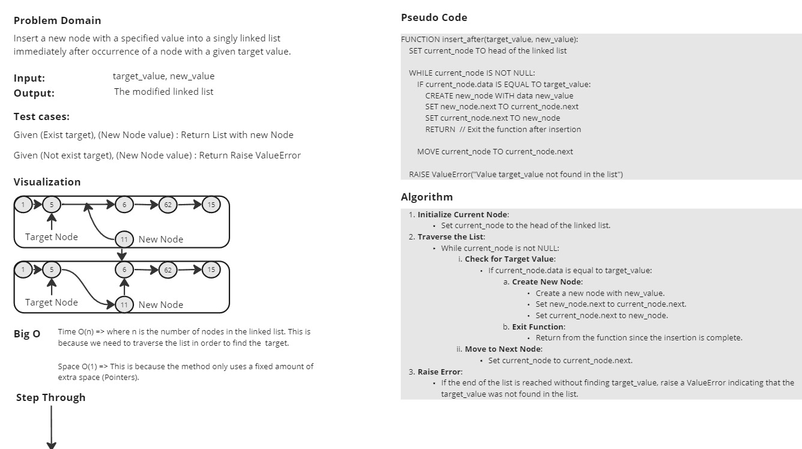

# Singly Linked List Implementation

This Python script implements a singly linked list data structure with the ability to append nodes and insert nodes after a specific value.

## Node Class

A class representing a node in a singly linked list.

### Node Attributes

- `data`: The data stored in the node.
- `next`: Reference to the next node in the linked list.

### Node Methods

- `__init__(self, data=None)`: Initializes a new node with the given data.
- No additional methods.

## LinkedList Class

A class representing a singly linked list.

### LinkedList Attributes

- `head`: The head node of the linked list.

### LinkedList Methods

- `__init__(self)`: Initializes an empty linked list.
- `append(self, data)`: Appends a new node with the given data to the end of the linked list.
- `__str__(self)`: Converts the linked list to a string representation.
- `insert_after(self, target_value, new_value)`: Inserts a new node with the specified new_value immediately after the first node that contains target_value in the linked list.

## White Bord

.jpg>)
