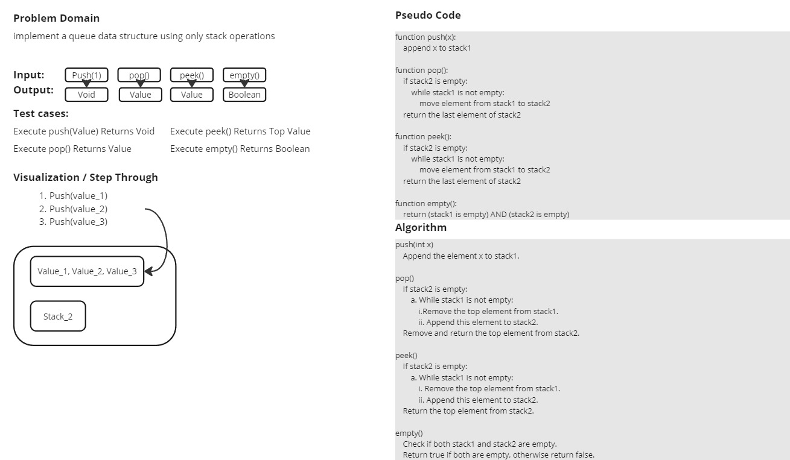

# MyQueue Class Documentation

## Overview

The `MyQueue` class implements a queue data structure using two stacks. This allows the queue to support First-In-First-Out (FIFO) operations using Last-In-First-Out (LIFO) stack operations.

## Class Definition

**Methods:**

- `__init__` : Initializes the MyQueue instance by creating two empty stacks, stack1 and stack2.

- `push(x)` : Pushes element x to the back of the queue by appending it to stack1.

- `pop()` : Removes and returns the element from the front of the queue. If stack2 is empty, elements from stack1 are moved to stack2 to maintain the correct order.

- `peek()` :  Returns the element at the front of the queue without removing it. If stack2 is empty, elements from stack1 are moved to stack2 to maintain the correct order.

- `empty()` : Checks whether the queue is empty by verifying that both stack1 and stack2 are empty.

## White Board

.jpg)
