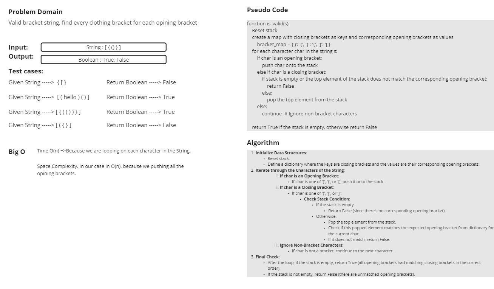
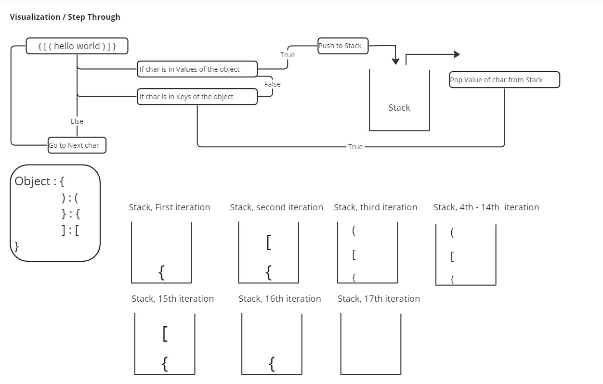

# Stack Class Documentation

## Overview

The `Stack` class implements a stack data structure using a list. It supports typical stack operations such as push, pop, and checking if the stack is empty. Additionally, it provides a method to validate the correctness of brackets in a given string.

## Class Definition

**Methods:**

- `__init__`: Initializes an empty stack.

- `push(item)`: Adds an item to the top of the stack.

- `pop()`: Removes and returns the item from the top of the stack. Returns `None` if the stack is empty.

- `is_empty()`: Checks if the stack is empty.

- `is_valid(s: str) -> bool`: Checks if a given string of brackets is valid. Returns `True` if the string is valid, `False` otherwise.

## White Board

