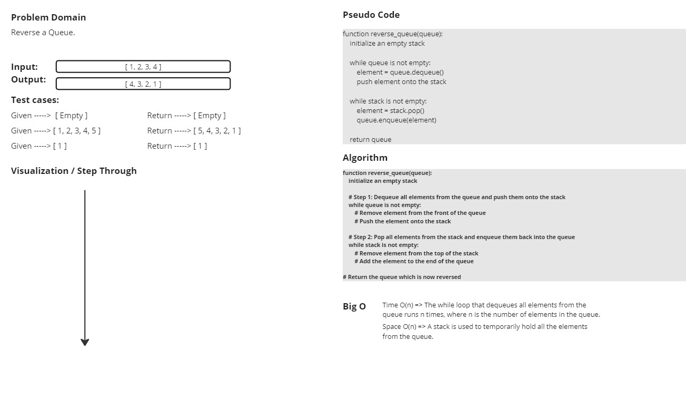
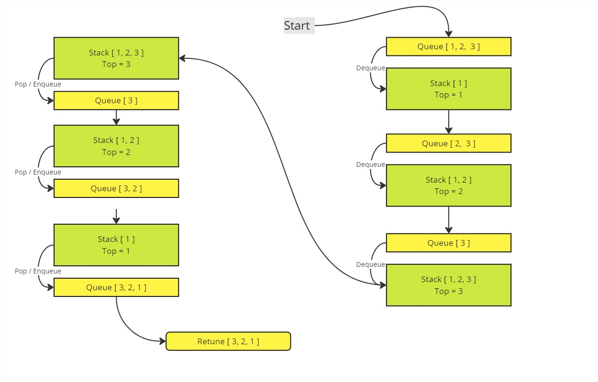

# Queue Class

A simple implementation of a queue using a list.

## Methods

### `is_empty() -> bool`

Checks if the queue is empty.

### `enqueue(item) -> None`

Adds an item to the end of the queue.

### `dequeue() -> any`

Removes and returns the item from the front of the queue. Raises `IndexError` if the queue is empty.

### `size() -> int`

Returns the number of items in the queue.

### `__repr__() -> str`

Returns a string representation of the queue.

## reverse_queue Function

Reverses the order of elements in a given queue.

### Arguments

- `queue (Queue)`: The queue to be reversed.

### Returns

- `Queue`: The queue with the elements in reversed order.

## White Board

