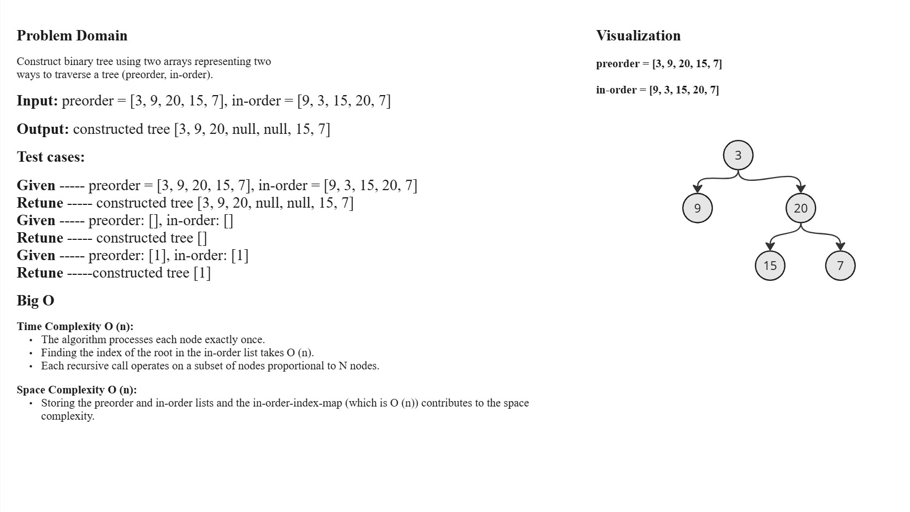
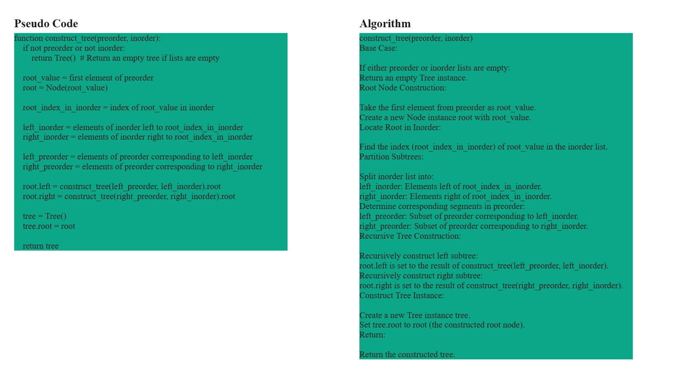
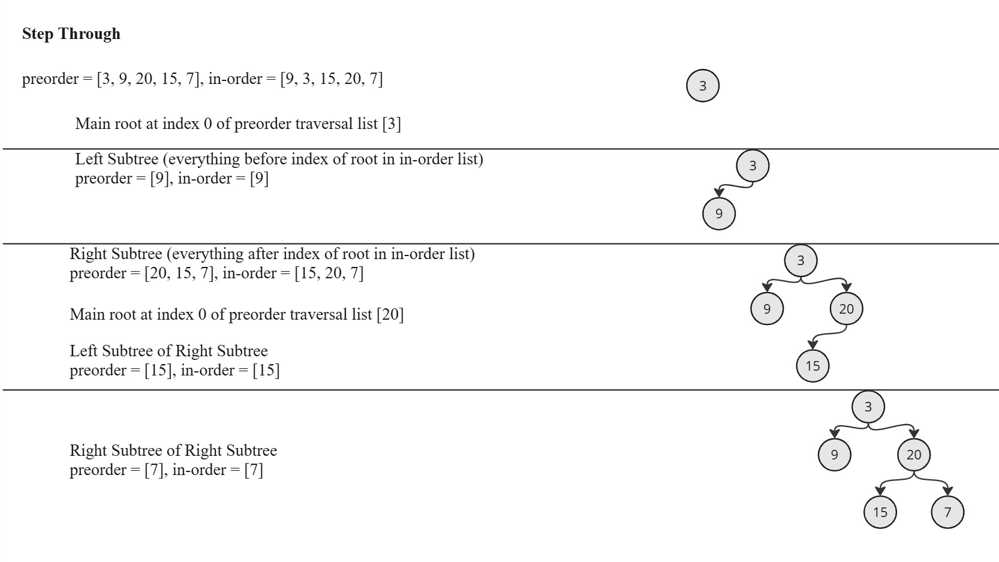

# Binary Tree Construction

This Python script provides functionality to construct a binary tree from given preorder and inorder traversal arrays.

## `Node` Class

The Node class represents a single node in a binary tree. Each node stores a value and references to its left and right child nodes.

### Node Constructor

`__init__(self, value)`: Initializes a new node with the given value.

## `Tree` Class

The Tree class represents a binary tree. It has an attribute root which points to the root node of the tree.

### Tree Constructor

`__init__(self)`: Initializes an empty binary tree.

`__str__(self)`: Returns a string representation of the tree as an array. It performs a level-order traversal to serialize the tree.

## construct_tree Function

The construct_tree function constructs a binary tree given preorder and inorder traversal arrays.

### Arguments

***preorder (List[int])***: Preorder traversal of the binary tree.

***inorder (List[int])***: Inorder traversal of the binary tree.

**Returns**
Node: The root node of the constructed binary tree.

## White-Board

