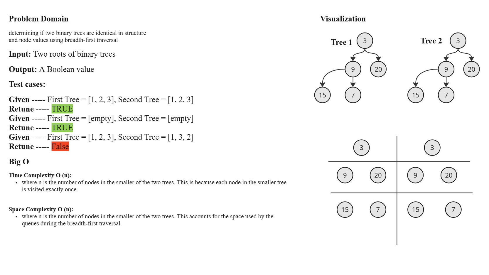
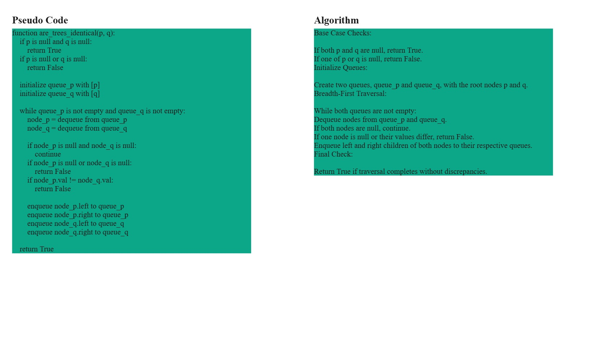
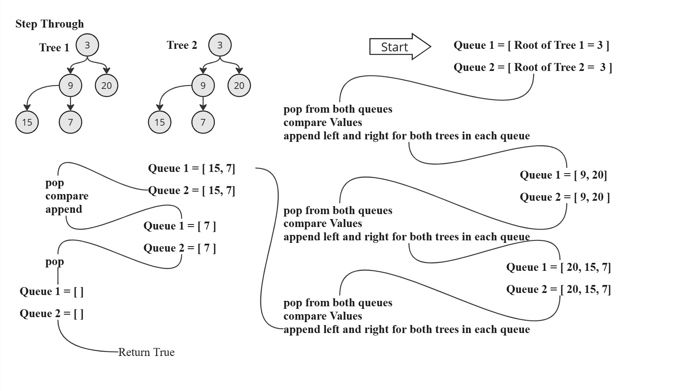

# Are they the same

## Function: `are_trees_identical`

Checks if two binary trees are identical in structure and node values.

### Parameters

- `p` (`Node`): Root of the first binary tree.
- `q` (`Node`): Root of the second binary tree.

### Returns

- `bool`: `True` if the binary trees rooted at `p` and `q` are identical (same structure and node values), `False` otherwise.

### Description

This function performs a breadth-first search (BFS) traversal simultaneously on both trees (`p` and `q`). It compares corresponding nodes at each level to determine if the trees are identical. If both trees are empty (`None`), they are considered identical. If only one of the trees is empty and the other is not, they are not identical. If at any level, corresponding nodes have different values or structures, the function returns `False`. If the traversal completes without finding any differences, the function returns `True`.

## White-Board

