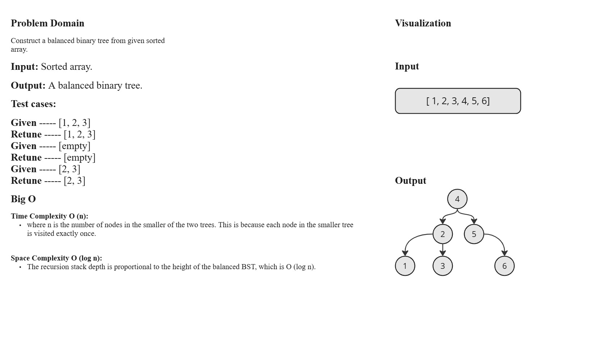
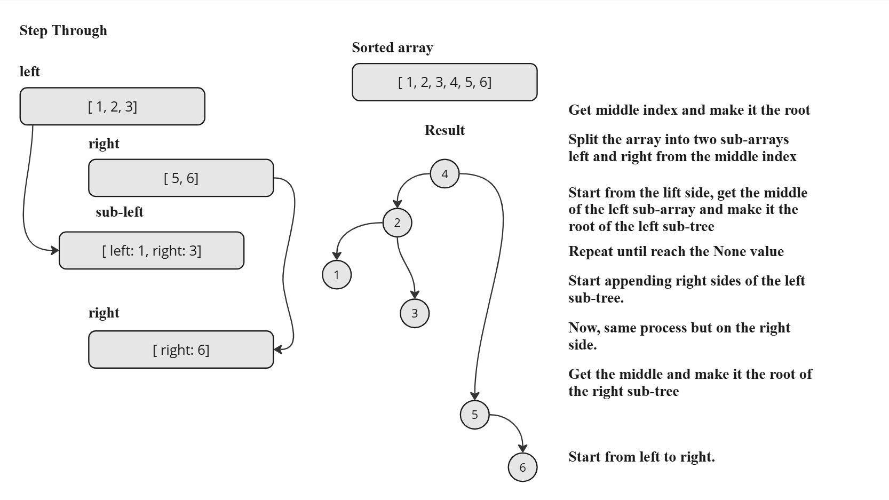
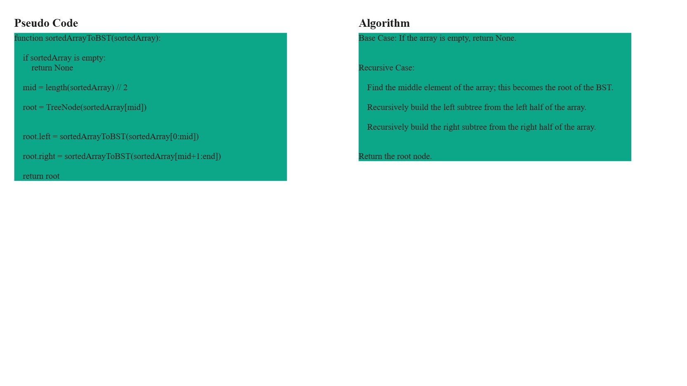

# Documentation

## `TreeNode` Class

The `TreeNode` class is a constructor for creating a node in a binary tree.

- **Constructor**: `__init__(self, val=0, left=None, right=None)`
  - **Arguments**:
    - `val` (int): The value of the node.
    - `left` (TreeNode, optional): The left child node.
    - `right` (TreeNode, optional): The right child node.

## `sortedArrayToBST` Function

The `sortedArrayToBST` function constructs a balanced Binary Search Tree (BST) from a sorted array.

- **Definition**: `def sortedArrayToBST(sortedArray)`
  - **Arguments**:
    - `sortedArray` (list of int): A sorted array of integers.
  - **Returns**:
    - `TreeNode`: The root node of the constructed BST.

## `inOrderTraversal` Function

The `inOrderTraversal` function performs in-order traversal of a binary tree and stores node values in a list.

- **Definition**: `def inOrderTraversal(root, values)`
  - **Arguments**:
    - `root` (TreeNode): The root node of the tree.
    - `values` (list): An empty list to store node values in-order.

## White-Board

