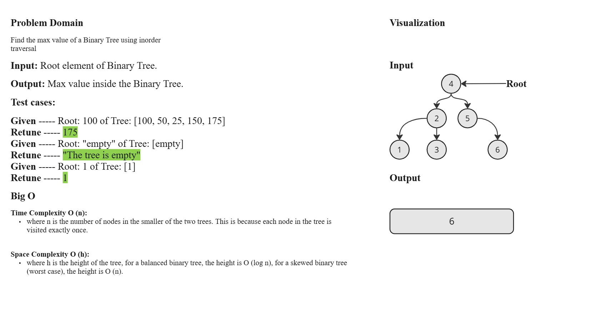
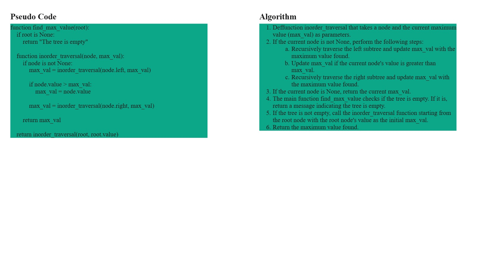
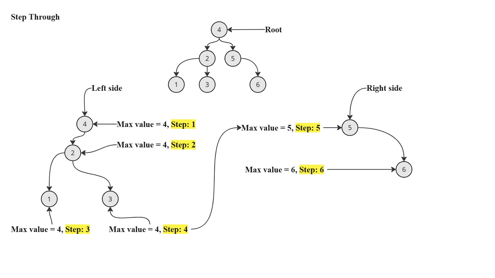

# `find_max_value` Function Documentation

## Description

The `find_max_value` function is designed to find the maximum value in a binary tree using in-order traversal. This function is useful for traversing a binary tree to identify the highest value contained within it.

## Parameters

- `root`: The root node of the binary tree. This node should be an instance of a class representing a node in the binary tree, typically containing at least two attributes:
  - `value`: The value stored at the node.
  - `left`: A reference to the left child node.
  - `right`: A reference to the right child node.

## Returns

- If the binary tree is empty (i.e., the `root` is `None`), the function returns the message `"The tree is empty"`.
- Otherwise, it returns the maximum value found in the binary tree.

## White-Board

