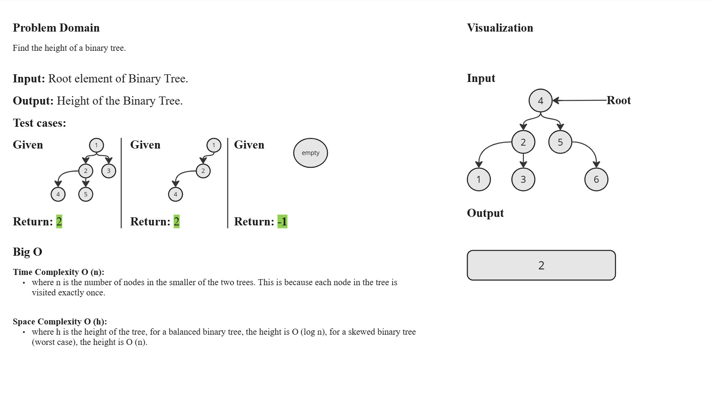
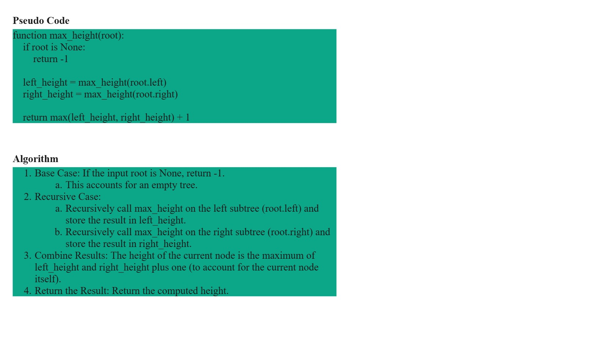
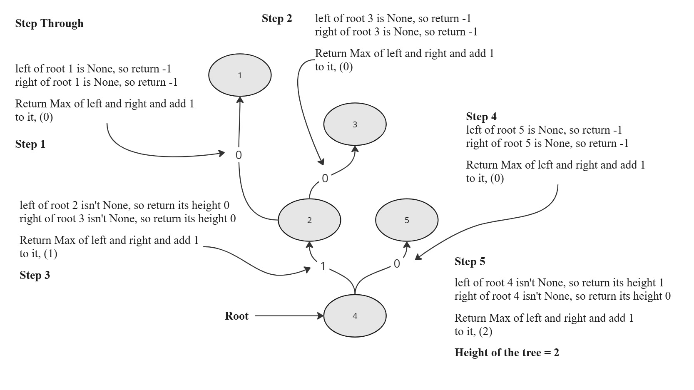

# `max_height` Function Documentation

## Description

The `max_height` function calculates the maximum height of a binary tree.

The height of a binary tree is defined as the number of edges on the longest path from the root to a leaf node.

## Parameters

- `root (TreeNode)`: The root node of the binary tree.

This node is an instance of the `TreeNode` class, which represents a node in the binary tree.

## Returns

- `int`: The maximum height of the binary tree.

The height is defined as the number of edges on the longest path from the root to a leaf node.

If the tree is empty (`root` is `None`), the function returns `-1`.

## White-Board

